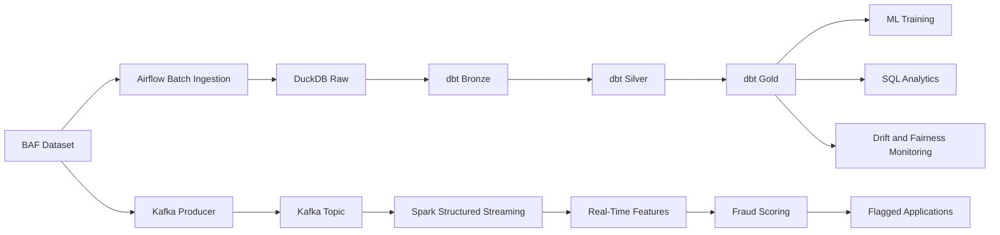

```mermaid
flowchart LR
    A[BAF Dataset] --> B[Airflow Batch Ingestion]
    A --> C[Kafka Producer]

    C --> D[Kafka Topic]
    D --> E[Spark Structured Streaming]
    E --> F[Real-Time Features]
    F --> G[Fraud Scoring]
    G --> H[Flagged Applications]

    B --> I[DuckDB Raw]
    I --> J[dbt Bronze]
    J --> K[dbt Silver]
    K --> L[dbt Gold]

    L --> M[ML Training]
    L --> N[SQL Analytics]
    L --> O[Drift and Fairness Monitoring]
```
