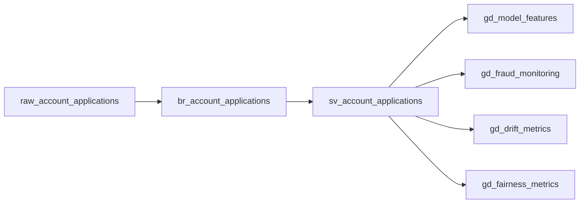

```mermaid
flowchart LR
    A[raw_account_applications] --> B[br_account_applications]
    B --> C[sv_account_applications]
    C --> D[gd_model_features]
    C --> E[gd_fraud_monitoring]
    C --> F[gd_drift_metrics]
    C --> G[gd_fairness_metrics]
```
