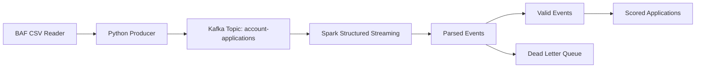

```mermaid
flowchart LR
    A[BAF CSV Reader] --> B[Python Producer]
    B --> C[Kafka Topic: account-applications]
    C --> D[Spark Structured Streaming]
    D --> E[Parsed Events]
    E --> F[Valid Events]
    E --> G[Dead Letter Queue]
    F --> H[Scored Applications]
```

